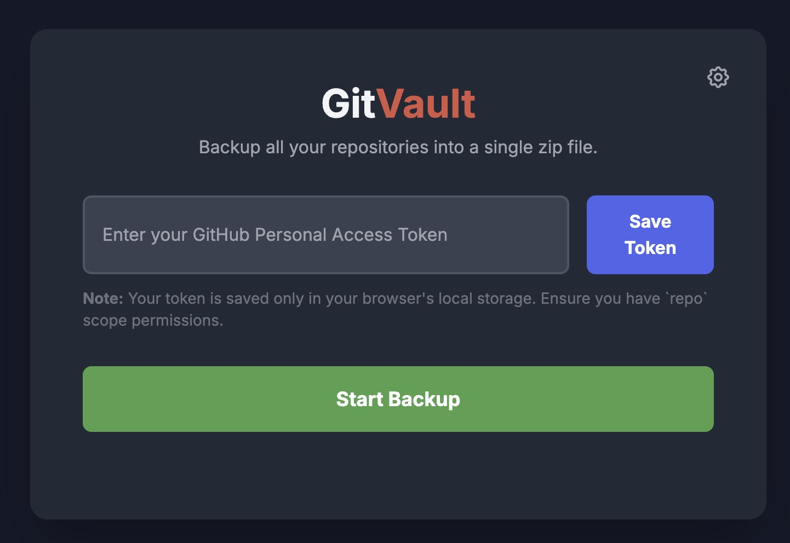

# GitVault 🛡️ - GitHub Repository Backup Tool

GitVault is a powerful, browser-based tool to back up all of your public and private GitHub repositories into a single, convenient `.zip` file. It runs entirely in your browser, ensuring your GitHub token and code remain completely private.

## ✨ Security & Privacy First

**Your data never leaves your browser.** This is the core principle of GitVault.

-   ✅ **100% Client-Side:** The entire backup process—from fetching your repository list to creating the final `.zip` file—happens directly on your machine. No files or credentials are ever sent to a third-party server.
-   ✅ **Secure Token Storage:** Your GitHub Personal Access Token (PAT) is saved exclusively in your browser's `localStorage`. It is only used to communicate directly with the official GitHub API.
-   ✅ **No Installation Required:** As a single HTML file, there's no software to install and no complex setup, minimizing security risks.

## 🚀 Features

-   **Comprehensive Backups:** Fetches and backs up **all** repositories you have access to, including private, public, forked, and organization repositories.
-   **All-in-One Download:** Downloads each of your repositories and intelligently bundles them into a single, timestamped `.zip` file.
-   **Client-Side Zipping:** Uses the `JSZip` library to create the entire zip archive in your browser's memory, no server needed.
-   **Resilient Downloader:** Includes a `fetch-with-retry` mechanism to automatically retry failed downloads, making the backup process more robust against temporary network issues.
-   **Live Progress Log:** A detailed status log shows you exactly what's happening in real-time, including repository discovery, download progress, and any errors encountered.
-   **Modern UI:** A clean, responsive, dark-themed interface built with Tailwind CSS, featuring a collapsible settings panel, animated feedback, and toast notifications.

## 🛠️ How It Works

GitVault orchestrates several modern web technologies to perform its magic right in your browser:

1.  **Authentication:** The user provides a GitHub Personal Access Token (PAT), which is stored in `localStorage` for future use.
2.  **Repository Discovery:** Using your PAT, the tool makes paginated calls to the GitHub API to fetch a complete list of all your repositories.
3.  **Individual Downloads:** For each repository in the list, it fetches the source code as a `.zip` archive (`zipball`) from the GitHub API. A CORS proxy is used to handle browser security requirements for these requests.
4.  **In-Memory Archiving:** As each repository's `.zip` file is downloaded, it's added directly to a new, larger `.zip` archive being created in memory using **JSZip**.
5.  **Final Generation:** Once all repositories have been processed, JSZip generates the final, consolidated `.zip` file as a `Blob`.
6.  **Saving the File:** **FileSaver.js** is used to trigger a browser download prompt, allowing you to save the final `github-backup-YYYY-MM-DD.zip` file to your computer.

## 📖 How to Use

Backing up your repositories is a simple, three-step process.

### Step 1: Generate a GitHub Personal Access Token (PAT)

You'll need a GitHub PAT to allow the tool to access your repositories.

1.  Go to your GitHub **[Developer settings](https://github.com/settings/tokens)**.
2.  Click **"Generate new token"** (select "Generate new token (classic)").
3.  Give your token a descriptive name (e.g., "GitVault Backup Tool").
4.  Set an expiration date.
5.  Under **"Select scopes,"** check the entire **`repo`** scope. This is required to access both public and private repositories.
6.  Click **"Generate token"** and copy the token immediately. You won't be able to see it again.

### Step 2: Save Your Token in GitVault

1.  Open the GitVault `index.html` file in your browser.
2.  Click the **settings icon** (⚙️) at the top right.
3.  Paste your copied PAT into the input field.
4.  Click **"Save Token."** A confirmation message will appear.

### Step 3: Start the Backup

1.  Click the large **"Start Backup"** button.
2.  The backup process will begin, and you can monitor its progress in the log that appears.
3.  Once complete, your browser will automatically prompt you to save the final `.zip` file.

## 💻 Technologies Used

-   **HTML5 / CSS3**
-   **JavaScript (ES6+ with async/await)**
-   **Tailwind CSS** (via CDN)
-   **JSZip.js** (via CDN) - For client-side zip file creation.
-   **FileSaver.js** (via CDN) - For saving the generated file.
-   **GitHub API**

## ⚠️ Important Notes & Limitations

-   **CORS Proxy:** This tool relies on a public CORS proxy (`corsproxy.io`) to download repository files. If this service is down or changes its policies, the tool may not function correctly.
-   **Browser Memory:** Backing up a very large number of repositories (or very large individual repositories) can consume a significant amount of browser memory. The process may be slow or fail on machines with limited RAM.
-   **API Rate Limits:** The tool makes numerous API calls. While it's designed to be efficient, users with thousands of repositories might approach GitHub's API rate limits.

## 📄 License

This project is open source and available under the [MIT License](LICENSE).
  
